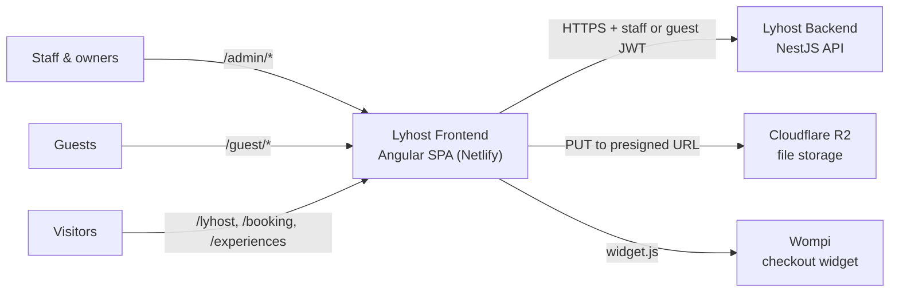
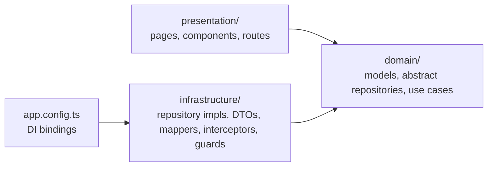

# Architecture

How the Lyhost frontend is built: what sits around it, how the code is layered, and the
cross-cutting rules every feature follows. For the reasoning behind each choice, see the
[ADRs](../adr/). For step-by-step flows, see [data-flows.md](data-flows.md). For component
conventions, see [ui.md](ui.md).

## 1. System context

Who and what the frontend talks to.



- **Staff and owners** use the admin back office under `/admin`: properties, units,
  reservations, CRM, staff, shifts, inventory, incidents, experiences, settings, audit log.
- **Guests** use the guest portal under `/guest`: cart, checkout, reservations, check-in.
- **Visitors** browse the public catalog (units and experiences) without an account.
- Every piece of data comes from the backend. The frontend never talks to the database,
  and it uploads files straight to R2 with a presigned URL the backend issues.

## 2. Containers

One static single-page app. There is no SSR and no frontend server: `ng build` produces
`dist/lymon-frontend/browser`, and Netlify serves it, answering every path with
`index.html` so the Angular router can handle it ([`netlify.toml`](../../netlify.toml)).

The backend URL is compiled in from `src/environments/` (see the
[README](../../README.md#3-pick-the-api)).

## 3. Layers (Clean Architecture)

Dependencies only point inward:



| Layer | Contains | Must not |
|---|---|---|
| `src/app/domain/` | Models (plain interfaces and types), repositories as **abstract classes**, use cases (`@Injectable`, one `execute()` method) | Import `HttpClient`, DTOs, `environment`, or anything from `infrastructure/` or `presentation/` |
| `src/app/infrastructure/` | `*.repository.impl.ts` (HTTP), DTOs, mappers, interceptors, guards, token and session services | Contain UI or business rules |
| `src/app/presentation/` | Pages (smart: call use cases, hold signals), components (dumb: inputs and outputs), layouts, route files | Call `HttpClient` or a repository implementation directly |

Abstract repositories are bound to their implementations in
[`app.config.ts`](../../src/app/app.config.ts):

```typescript
{ provide: CrmRepository, useClass: CrmRepositoryImpl },
```

A use case injects `CrmRepository` and never knows HTTP is involved. Tests swap in a mock
the same way.

Each layer is split by **audience**, then by **feature**, and a feature uses the same
folder name in every layer:

```
src/app/domain/tenant/crm/              crm-guest.model.ts, crm.repository.ts, use-cases/
src/app/infrastructure/tenant/crm/      crm.dto.ts, crm.mapper.ts, crm.repository.impl.ts
src/app/presentation/tenant/features/crm/pages/   guests-crm/, guest-profile/
```

Guards follow the same split: route guards for the guest portal live in
`infrastructure/guest/guards/`, guards for the admin back office in
`infrastructure/tenant/guards/`.

## 4. Module map

| Audience | Features (`src/app/domain/<audience>/*`) |
|---|---|
| `tenant` (staff & owners) | `auth`, `auth-session`, `user`, `tenant`, `staff`, `shift`, `crm`, `tenant-guest`, `experience`, `inventory`, `supplier`, `incident-report`, `audit-log`, `notification`, `storage`, `image-storage` |
| `guest` | `guest-auth`, `guest-session`, `guest-cart`, `guest-experience`, `guest-reservation`, `payment` |
| `shared` (used by both) | `property` (properties and units), `reservation`, `plan` |

Presentation has one folder per audience, plus `public/` for the catalog and `shared/` for
UI primitives:

| Folder | Routes | Guard |
|---|---|---|
| `presentation/public/` | `/lyhost`, `/booking`, `/room-details/:unitId`, `/experiences/:id` | none |
| `presentation/guest/` | `/guest/login`, `/guest/register`, … | `guestPublicGuard` |
| | `/guest/cart`, `/guest/reservations`, `/guest/checkin`, `/guest/payment/*` | `guestGuard` |
| `presentation/tenant/` | `/login`, `/register`, `/recover-password`, `/recover-password/confirm` | `adminPublicGuard` |
| | `/admin/*`, inside `TenantShellComponent` | `adminGuard` |
| `presentation/shared/` | none: `button`, `input`, `select`, `modal`, `calendar`, … | |

`app.routes.ts` concatenates `public.routes.ts`, `guest.routes.ts` and `tenant.routes.ts`,
and sends `/` and unknown paths to `/lyhost`.

## 5. Cross-cutting concerns

### Authentication

There are two separate sessions, one per audience, each stored in `localStorage`:

| | Staff | Guest |
|---|---|---|
| Token service | `TokenService` (`lymon_access_token`, `lymon_refresh_token`) | `GuestTokenService` (`lymon_guest_*`) |
| Interceptor | `authInterceptor`: every request except `/guest/*` and R2 | `guestAuthInterceptor`: `/guest/*` except `/guest/auth/*` |
| Refresh endpoint | `POST /auth/refresh` | `POST /guest/auth/refresh` |
| Proactive refresh | `TokenRefreshSchedulerService`, started in `app.ts`, refreshes 120 s before expiry | none |
| Session expired | → `/login?sessionExpired=true` | → `/guest/login?sessionExpired=true` |

Both interceptors refresh when the access token has less than 60 s left, retry once on a
`401`, and share a single in-flight refresh request so parallel calls don't each refresh.
See [data-flows.md](data-flows.md#2-staff-login-and-token-refresh).

Guards only check that a token exists (`isAuthenticated()`). Permissions are enforced by
the backend, which returns `403`.

### Routing

- Staff auth pages stay at the root (`/login`, `/recover-password/confirm`) because the
  backend emails links to those paths. Everything behind the staff session hangs off
  `/admin`.
- In route arrays, static segments go above parameters (`experiences/new` before
  `experiences/:id`), or the parameter swallows them.
- Every page is loaded eagerly. There are no lazy-loaded routes yet.

### API access

- The base URL is `environment.apiUrl`, and per-feature paths are constants in the same
  file (`environment.crm.endpoint`). Repository implementations build URLs from them.
- New endpoint constants go in **both** `environment.ts` and `environment.production.ts`.
- DTOs describe exactly what the API returns. Mappers turn them into domain models, so a
  backend rename touches one mapper instead of every page.

### State

- There is no global store. Pages keep their state in `signal()` and `computed()`.
- Session state lives in root services (`TokenService`, `UserSessionService`,
  `GuestTokenService`) that expose read-only signals.
- A use case can cache when the data rarely changes, for example
  `GetTenantProfileUseCase`.

### Polling

| What | Where | Interval |
|---|---|---|
| Staff notifications | `NotificationPollingService`, started by the dashboard | 15 s |
| Payment status after the Wompi widget closes | `payment-panel` in the cart page | 1 s, growing ×1.5 up to 5 s, at most 15 tries |

### Language

Code, comments and commits are in English. Everything the user reads (labels, messages,
validation errors) is in Spanish.
