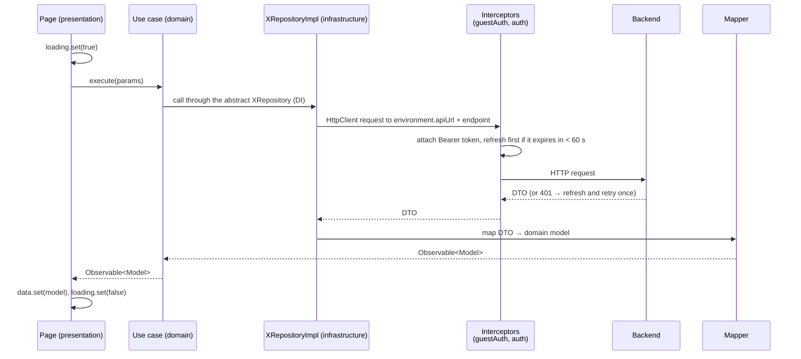
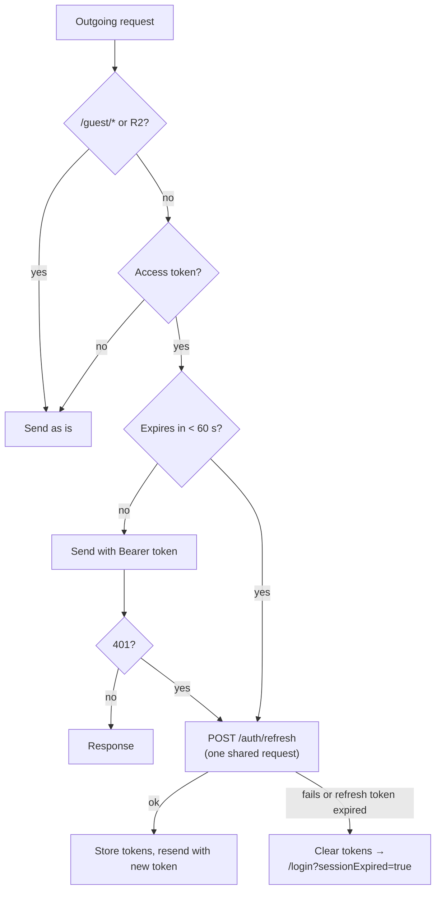
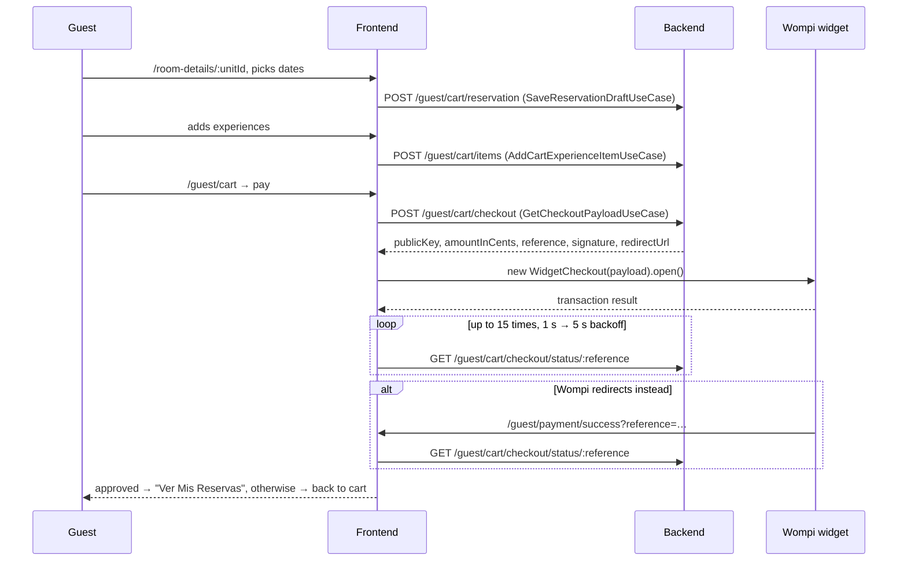

# Data flows

How the main interactions move through the app. For the structure these flows run on, see
the [architecture overview](README.md).

## 1. Request lifecycle (any API call)

Pages subscribe with `takeUntilDestroyed(this.destroyRef)`, so leaving the page cancels the
request. On error, the page sets an error signal with a Spanish message. Some features
translate backend errors through `presentation/shared/utils/http-error-translator.ts`.

## 2. Staff login and token refresh

1. `/login` → `LoginComponent` calls `LoginUseCase`.
2. `AuthRepository.login()` sends `POST /auth/login`. The use case stores the tokens and
   the user through `AuthSessionRepository` (backed by `TokenService` and
   `UserSessionService`).
3. `TokenService.isAuthenticated` flips to `true`. `adminGuard` now lets `/admin/*`
   through, and `adminPublicGuard` keeps the user away from `/login`.
4. `TokenRefreshSchedulerService` reacts to that signal and schedules a refresh 120 s
   before the access token expires.

From then on, `authInterceptor` handles every staff request:

The guest flow is the same with `POST /guest/auth/login`, `GuestTokenService`,
`guestAuthInterceptor` and `/guest/login`. It has no scheduler: guest tokens are refreshed
only on demand.

## 3. Guest booking: unit → cart → Wompi → result

- Visiting `/room-details` or `/experiences` needs no account. The cart and everything
  after it sit behind `guestGuard`.
- The Wompi script is loaded globally in `src/index.html`.
- The frontend never decides whether a payment succeeded. It only shows the status the
  backend reports, and the backend learns it from Wompi's webhook.

## 4. File upload (staff)

1. The page calls `UploadFileUseCase.execute(file, category)`.
2. `StorageRepository.getPresignedUrl()` sends `POST /storage/presigned-url` with the file
   name, type, size and category. The backend checks them and returns `presignedUrl`,
   `fileUrl` and `key`.
3. `uploadToPresignedUrl()` sends a `PUT` with the file straight to R2. `authInterceptor`
   skips `r2.cloudflarestorage.com`, so no JWT leaks to R2.
4. The page saves the **`key`** on the resource (for example
   `UpdateUnitMediaKeysUseCase`), never the URL. The backend builds URLs when it returns the
   resource.
